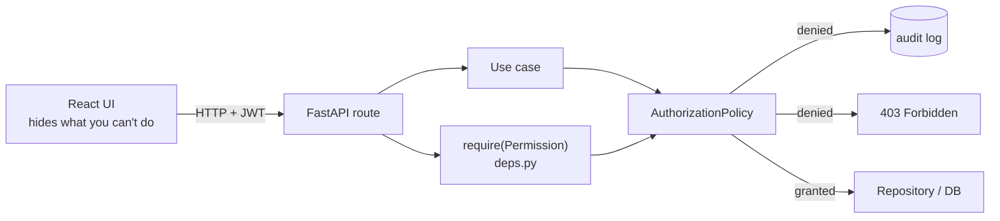

# Role-Aware Access (RBAC) on the Full Stack FastAPI Template

Adds three roles — `admin`, `manager`, `member` — to the
[full-stack-fastapi-template](https://github.com/fastapi/full-stack-fastapi-template)
(imported at commit `486f054`), enforced in the backend and reflected in the UI.

The original template README is kept as [TEMPLATE_README.md](TEMPLATE_README.md);
the assignment brief is [TASK.md](TASK.md). Scope cuts and trade-offs are in
[NOTES.md](NOTES.md), and the reasoning behind the main design choice is in
[docs/adr/0001-policy-layer-over-route-decorators.md](docs/adr/0001-policy-layer-over-route-decorators.md).
How that decision was argued out — the disagreements between the two agents that
reviewed the plan, and which side each was settled on — is in
[docs/agent-discussion.md](docs/agent-discussion.md), with the raw logs in
[`.myteam/`](.myteam).

## Permission matrix

Roles map to permissions; endpoints require permissions, never roles. This is
the whole model, and it lives in one file:
[`backend/app/core/domain/rbac.py`](backend/app/core/domain/rbac.py).

| Action | Permission | admin | manager | member |
|---|---|:---:|:---:|:---:|
| List all users | `user:list` | ✓ | ✓ | ✗ |
| Create user | `user:create` | ✓ | ✗ | ✗ |
| Read another user | `user:read_any` | ✓ | ✓ | ✗ |
| Update any profile | `user:update_any` | ✓ | ✗ | ✗ |
| Delete any user | `user:delete_any` | ✓ | ✗ | ✗ |
| View metrics | `metrics:view` | ✓ | ✓ | ✗ |
| Manage global settings | `settings:manage` | ✓ | ✗ | ✗ |
| Manage any user's items | `item:manage_any` | ✓ | ✗ | ✗ |
| View and update own profile | `profile:update_own` | ✓ | ✓ | ✓ |

Reading and updating *your own* profile needs no special role — every
authenticated user holds `profile:update_own`. Items remain owner-scoped;
`item:manage_any` lifts that scope.

### Protected surface

| Endpoint | Required permission |
|---|---|
| `GET /api/v1/users/` | `user:list` |
| `POST /api/v1/users/` | `user:create` |
| `GET /api/v1/users/{id}` | `user:read_any` (or self) |
| `PATCH /api/v1/users/{id}` | `user:update_any` |
| `DELETE /api/v1/users/{id}` | `user:delete_any` |
| `GET /api/v1/metrics/summary` | `metrics:view` |
| `GET|PATCH /api/v1/users/me` | authenticated |
| `GET /api/v1/users/me/permissions` | authenticated |
| `POST /api/v1/utils/test-email/` | `settings:manage` |
| `POST /api/v1/password-recovery-html-content/{email}` | `settings:manage` |

## How authorization works

**Where the checks live.** Every protected endpoint declares a FastAPI
dependency built by `require(Permission.X)` in
[`backend/app/api/deps.py`](backend/app/api/deps.py), or delegates to a use case
that calls `AuthorizationPolicy.require(...)` itself. Either way the decision is
made by one class,
[`AuthorizationPolicy`](backend/app/core/use_cases/authorization_policy.py),
which is a pure function of `(Role, Permission)` plus a warning-level audit log
of every denial (who, which permission, which resource). Checks run before any
side effect and before any sensitive read, so a denied caller cannot probe which
records exist. `deps.py` is the composition root — the only place where
abstractions meet implementations.

**How roles are stored and validated.** A `role` column on the `user` table is
the single source of truth, added by migration `b7c31d9f4a20` with a backfill
that promotes existing superusers to `admin`. The legacy `is_superuser` boolean
stays in the schema for migration compatibility and for API clients that still
read it, but it is *derived* from `role` in
[`crud.sync_legacy_superuser_flag`](backend/app/crud.py) and is never consulted
for an access decision. Valid values are constrained by the `Role` enum at the
API boundary.

**How the frontend learns its capabilities.** It asks the backend:
`GET /api/v1/users/me/permissions` returns the caller's permission list, which
[`usePermissions`](frontend/src/hooks/usePermissions.ts) exposes as `can(...)`.
Nav links and buttons render from that list rather than from a hardcoded role
table in TypeScript, so a change to the matrix needs no frontend release.
Hiding UI is a UX affordance only — the backend re-checks every request.

**Privilege escalation is closed by construction.** `PATCH /users/me` accepts
`UserUpdateMe`, which has no `role` field, and the use case takes a
`ProfileUpdate` dataclass that has none either; there is no code path from
self-service to a role change. Signup ignores `role` and always produces a
`member`.

### Where the checks sit



## Architecture

Dependencies point inward; `app/core/` never imports a framework or the ORM.

| Layer | Location | Contents |
|---|---|---|
| Entities | `backend/app/core/domain/` | `Role`, `Permission`, `ROLE_PERMISSIONS`, `User` |
| Use cases | `backend/app/core/use_cases/`, ports in `core/ports/` | `AuthorizationPolicy`, `ListUsersUseCase`, `CreateUserUseCase`, `UpdateOwnProfileUseCase` |
| Adapters | `backend/app/api/`, `backend/app/infrastructure/` | routes, `deps.py`, repository, mappers |
| Infrastructure | `backend/app/models.py`, `core/db.py`, `alembic/`, `frontend/` | SQLModel tables, engine, migrations, React |

This is enforced, not documented on trust:
[`backend/tests/test_architecture.py`](backend/tests/test_architecture.py) walks
the AST of every core module and fails on a forbidden import.

**Adding a role** is one line in `ROLE_PERMISSIONS` — no route, dependency, or
frontend change.

## Running it

### With Docker Compose (recommended)

```bash
docker compose up -d --build       # api, db, adminer, mailpit
docker compose exec backend python -m app.seed_data
```

- App and API: <http://localhost:8000>
- API docs: <http://localhost:8000/docs>
- Adminer: <http://localhost:8080>

For frontend hot reload, run Vite separately:

```bash
bun install
bun run dev                        # http://localhost:5173
```

### Locally, without Docker (except the database)

Requires Python ≥ 3.14 (the template uses PEP 758 `except A, B:` syntax),
[`uv`](https://docs.astral.sh/uv/) and [`bun`](https://bun.sh).

```bash
docker compose up -d db            # just Postgres

# Frontend build — FastAPI serves it from backend/app/frontend
bun install
bun run --filter frontend build

cd backend
uv sync
export POSTGRES_SERVER=localhost FASTAPI_ENV=development
uv run alembic upgrade head
uv run python -m app.seed_data
uv run uvicorn app.main:app --reload --port 8000
```

### Seeded accounts

`python -m app.seed_data` creates one user per role. The admin comes from
`FIRST_SUPERUSER` in `.env`; the other two are demo accounts. Passwords are the
`.env` defaults — change them for anything but local use.

| Email | Password | Role |
|---|---|---|
| `admin@example.com` | `changethis` | admin |
| `manager@example.com` | `changethis` | manager |
| `member@example.com` | `changethis` | member |

Sign in as each to see the surface change: `member` sees no Admin or Metrics nav
link and gets an **Access denied** page (not a silent redirect) when navigating
straight to `/admin`; `manager` sees both pages but no **Add User** button.

### Migrations

The role column ships as Alembic revision `b7c31d9f4a20`, applied by
`alembic upgrade head` (Docker Compose runs it on start via `prestart.sh`).

## Tests

```bash
cd backend
docker compose up -d db
export POSTGRES_SERVER=localhost FASTAPI_ENV=development
mkdir -p app/frontend                 # only if you have not built the frontend
uv run pytest
```

The template's session fixture truncates `user` and `item` when the run ends, so
pointing `pytest` at the database the running stack uses empties it. Re-run
`python -m app.seed_data` afterwards before browsing the app or running the
Playwright suite.

114 tests pass. The ones added here:

| File | Covers |
|---|---|
| `tests/test_rbac.py` | the matrix as a pure function; use cases with a mocked repository port — no DB, no HTTP; denials are logged, grants are not |
| `tests/api/routes/test_authorization.py` | HTTP translation: every protected endpoint asserted allowed *and* denied per role, `user:read_any` denials reaching the audit log, self-escalation via `PATCH /users/me`, role-free signup, `403` rather than an empty `200` |
| `tests/test_architecture.py` | the dependency rule, by AST walk over `core/` |

Frontend typecheck and build:

```bash
bun run lint
bun run --filter frontend build
```

Backend lint and types (the gates `.pre-commit-config.yaml` runs):

```bash
cd backend
uv run ruff check app tests
uv run ruff format --check app tests
uv run mypy app
```

Role-aware UI behaviour (needs the stack up and seeded):

```bash
cd frontend
bun x playwright install chromium
PLAYWRIGHT_BASE_URL=http://localhost:8000 bun x playwright test tests/rbac.spec.ts
```

`frontend/tests/rbac.spec.ts` asserts the hidden nav entries, the **Access
denied** page on a direct visit to `/admin` as a `member`, and the missing
**Add User** button for a `manager`.
