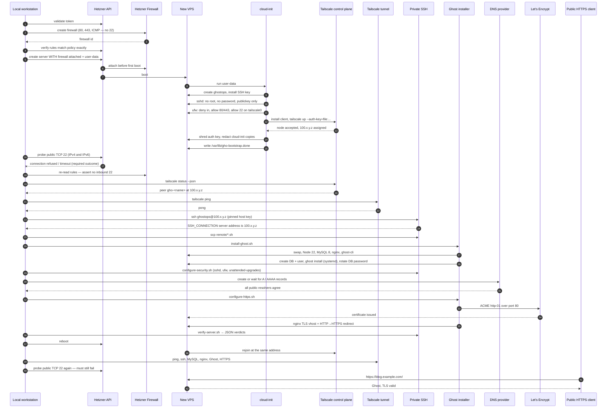

# Architecture

## The problem this solves

A conventional cloud VPS deployment opens TCP 22 to the internet, or to an
operator's current IP, so that a configuration tool can get in. That port then
absorbs credential-stuffing traffic forever, and the "temporary" allow rule
usually turns out to be permanent.

`ghost-hetzner-oneclick` never opens it. The provider firewall is created before
the server and attached in the same API call that creates it, so the machine has
no window of existence during which port 22 is reachable. Administrative access
arrives instead over a WireGuard tunnel that the server itself dials outbound.

## Two stages

**Stage 1 — cloud-init.** Only the work needed to establish private access:
create `ghostops`, install its key, harden sshd, install Tailscale, join the
tailnet with a one-time key, set the host firewall so 22 is only reachable on
`tailscale0`, write a status file, destroy every copy of the auth key it can
reach.

**Stage 2 — over the tunnel.** The local script discovers the new node in
`tailscale status --json`, pins its host key, connects as `ghostops` over the
tailnet address, uploads the remote scripts with `scp`, and runs the Ghost
installation. Every provisioning command travels through the tunnel. `rssh` and
`rscp` call `ssh_assert_private_target` first and refuse anything that is not a
`100.64.0.0/10` address, so a bug cannot silently fall back to the public IP.

## Sequence

## Module responsibilities

| File | Responsibility |
|---|---|
| `deploy.sh` | Stage orchestration, the wizard, failure and containment handling. Nothing else. |
| `lib/redact.sh` | The secret registry and the only redaction implementation. |
| `lib/ui.sh` | Terminal output and prompts. No side effects on infrastructure. |
| `lib/common.sh` | Logging, validation, timeouts, retries, atomic writes. |
| `lib/state.sh` | The state file, locking, stage bookkeeping, check history. |
| `lib/tools.sh` | Local dependency detection and checksum-verified installation. |
| `lib/hetzner.sh` | Every Hetzner API call. The only module that knows hcloud exists. |
| `lib/tailscale.sh` | The tunnel provider. Exposes a `tunnel_*` interface the orchestrator uses. |
| `lib/dns.sh` | Public DNS verification and the optional Cloudflare API path. |
| `lib/ssh.sh` | Private SSH, with the private-target guard. |
| `lib/verify.sh` | The step runner, every check predicate, and report rendering. |
| `templates/` | The rendered artifacts: cloud-init and the firewall policy. |
| `remote/` | What runs on the server. Each script is independently idempotent. |

## Why a tunnel provider interface

`lib/tailscale.sh` ends with a small `tunnel_*` surface: `tunnel_local_ready`,
`tunnel_wait_for_node`, `tunnel_node_address`, `tunnel_node_hostname`,
`tunnel_ping`, `tunnel_access_help`. `deploy.sh` calls only those. Adding a
second provider means adding a second file with the same six functions.

Only Tailscale is implemented and tested. No other provider is claimed.

## Idempotency and resume

State lives in `.ghost-hetzner/state.json`, written atomically. Stages
`firewall` through `report` record `done` and are skipped on a later run.

`preflight`, `credentials` and `settings` deliberately run on **every**
invocation, including `--resume`: they establish the tool paths, the API token
and the resolved configuration that the later stages need in memory. They ask no
new questions on a resume, and they do not re-ask for confirmation to create
billable resources.

On the server, each remote script checks the desired end state first. Ghost is
never reinstalled when `config.production.json` exists, and the database is never
recreated when it already holds Ghost tables.
